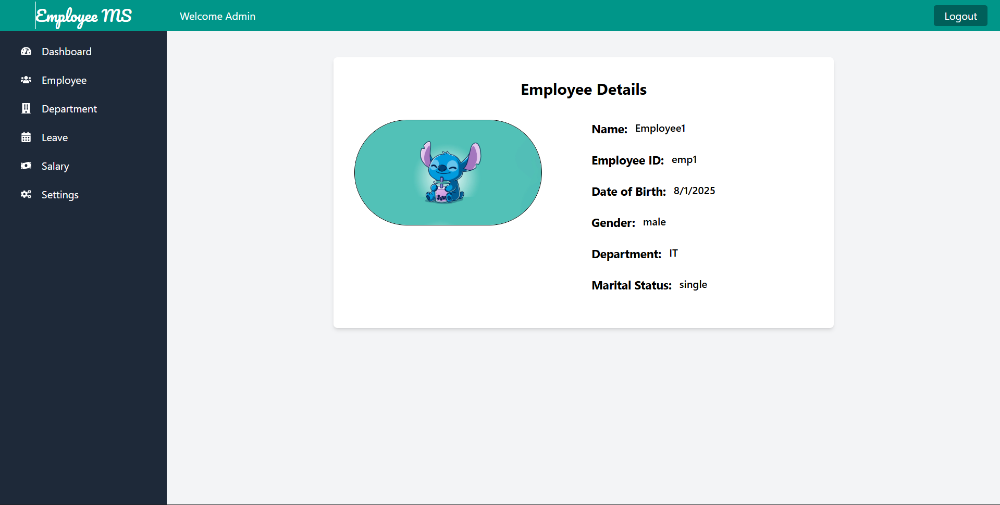

# 🚀 Project Name

A short, punchy tagline for your project.  
_Example:_ “An elegant task management app built with React and Firebase.”

---

## 🖼️ Project Screenshots

Here’s a preview of what the project looks like:

| Screenshot 1 | Screenshot 2 | Screenshot 3 | Screenshot 4 |
|:-------------:|:-------------:|:-------------:|:-------------:|
|  |  |  |  |

> 💡 Tip: Store your screenshots in a folder like `/assets/screenshots/` and update the image paths above.

---

## ✨ Features

- ✅ Feature 1 — what it does
- ⚡ Feature 2 — what makes it unique
- 🔒 Feature 3 — what problem it solves

---

## 🧰 Tech Stack

**Frontend:** React, Tailwind CSS  
**Backend:** Node.js, Express  
**Database:** MongoDB  
**Deployment:** Vercel / Render / Netlify

---

## 🚀 Getting Started

Clone the repository and install dependencies:

```bash
git clone https://github.com/yourusername/your-repo-name.git
cd your-repo-name
npm install
npm run dev
